# Filter Descriptions

### Video

[YUV Values/ MIN, AVG, MAX, LOW, HIGH](#yuv)
[YUV Values/ Difference](#diff)
[Saturation](#saturation)
[Hue](#hue)
[Temporal Outliers](#tout)
[Vertical Line Repetitions](#vrep)
[Broadcast Range](#brng)
[Crop Width (CropW)](#cropw)
[Crop Height (CropH)](#croph)
[Peak Signal to Noise Ratio (PSNRf)](#psnrf)
[Structural SImilarity Metric (SSIMf)](#ssimf)
[Mean Square Error (MSEf)](#msef)
[Interlacement Detection (single frame)](#singleframe)
[Interlacement Detection (multiple frames)](#multiframe)
[Interlacement Detection (repeated fields)](#repeated)

### Audio

[R.128](#r128)
[Audio Phase Meter](#phase)
[DC Offset](#dc)
[Audio Diffs](#audio-diffs)
[RMS](#rms)

## YUV Values/ MIN, AVG, MAX, LOW, HIGH {#yuv}

YUV refers to a particular a way of encoding color information in analog video where Y channels carry <q>luma</q>, or brightness information ([wikipedia.org/wiki/Luma](http://en.wikipedia.org/wiki/Luma_(video))), and U and V channels carry information about color, or <q>chrominance</q> ([wikipedia.org/wiki/Chrominance](http://en.wikipedia.org/wiki/Chrominance)). QCTools can analyze the YUV Values of a particular encoded video file in order to provide information about the appearance of the video. These filters examine every pixel in a given channel and records the Maximum, Minimum, and Average values.

Each plot shows a dot-dash line to show the limits of broadcast range. In the Y graph there is a red dash-dot line at 235 (the equivalent of 100 IRE) to show broadcast white and a blue dash-dot line is at 16 (the equivalent of 7.5 IRE) to show broadcast black. All values plotted above the red dash-dot line should be decoded as white with all visual distinction in the values from 235-255 clipped to the same maximum value of white. Similarly values plotted from 0-16 would all be clipped and portrayed as black. The U and V graphs have similar lines at 16 and 240 to show the broadcast range limits of the chroma planes. Note: that these lines are only applicable to content that is decoded as broadcast range. Content marked as full range may appropriately exceed these limits.
_(For in-depth descriptions of how luma and/or chroma noise -- and other types of artifacts-- may present, the **[A/V Artifact Atlas](https://bavc.github.io/avaa/index.html)** is an excellent reference.)_

### Y Value Filters: Y MIN, Y AVG, Y MAX

| Filter Domain | Filter Name(s) | Values |
| Y Channel | Y MIN, Y AVG, Y MAX | 0-255 |

Y Channels carry data about the brightness of a picture. Problematic variance in Y Channel values will manifest as a picture that is either too light or too dark, also known as containing luma noise. 8-bit video will have values falling in the range of 0-255 code values per pixel. A picture with well-balanced light levels will have an average, or mid-range Y Channel value of around 128 (Y AVG). Graph readings outside of that range will indicate a picture that is either too bright or too dark. A Y Value of 0 would indicate total blackness and a value of 255 would present as entirely white. In the range of values, reference black is at value 16, while reference white is at value 235\. Except during particular moments like scene changes where one might expect abrupt spikes , the average values of Y channels should remain relatively stable or constant with little variation. Portions of video showing extreme changes in average values (and not corresponding to a scene change or otherwise dramatic edit) likely indicate a picture error. Where you may expect luma spikes could be camera fade-ins/outs, or a sudden brightness in the picture, like a camera flash, for example.

To demonstrate the borders of broadcast range, blue guidelines are plotted at 16 and 235 for Y and 16 and 240 for U and V. Note that these guidelines are only applicable for video encoding in broadcast range. For video encoded as full range the guidelines are not relevant.

Y values = Combined graph of Y MAX, Y HIGH, Y AVG, Y LOW, and Y MIN
Y MIN = Y channel minimum
Y LOW = Y channel 10th percentile
Y AVG = Y channel average
Y HIGH = Y channel 90th percentile
Y MAX = Y channel maximum

#### Samples which demonstrate Y Value anomalies:

In the graph below, you can see the YMAX spikes which would manifest as white lines across the video picture:
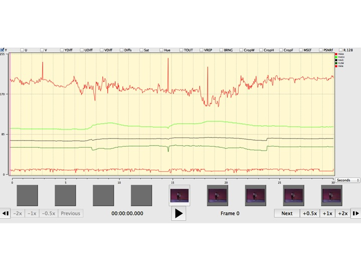

The graph below illustrates a reading with many luma spikes in the Y LOW, Y AVG, and Y HIGH, most notably in the first second of the graph.

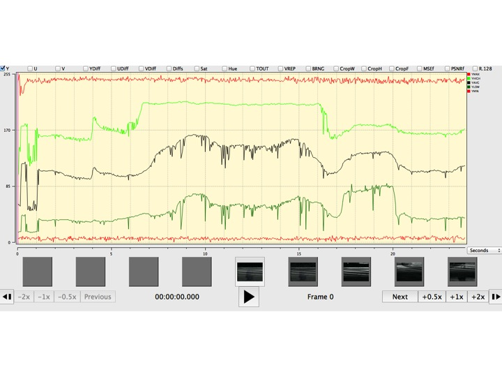

| Filter Domain | Filter Name(s) | Values* |
| Y Channel | Y LOW, Y HIGH | 16-235 |
| U Channel | U LOW, U HIGH | 16-235 |
| V Channel | V LOW, V HIGH | 0-255 |

### Y Value Filters: Y LOW, Y HIGH

This filter works in a similar fashion as the YUV \*MIN and \*MAX filters, but instead of looking at the absolute minimum and maximum value for these channels, it looks at the 10th percentile (LOW, or 16 pixels) and 90th percentile (HIGH, or 235 pixels) which present the outside limits or 'headroom' of the [legal broadcast range](http://en.wikipedia.org/wiki/Broadcast_range). An extreme minimum or maximum value could dramatically skew the graph but because they may be outside the viewable broadcast image (or the range of human perception), they may not necessarily be meaningful indicators of a problematic visual image that can be human-detectable. This is why Low/High measurements are so useful-- they ignore the extreme outliers (Min/ Max) in favor of those abnormalities which fall in the range of human perception.

#### Samples which demonstrate YUV LOW/HIGH anomalies:

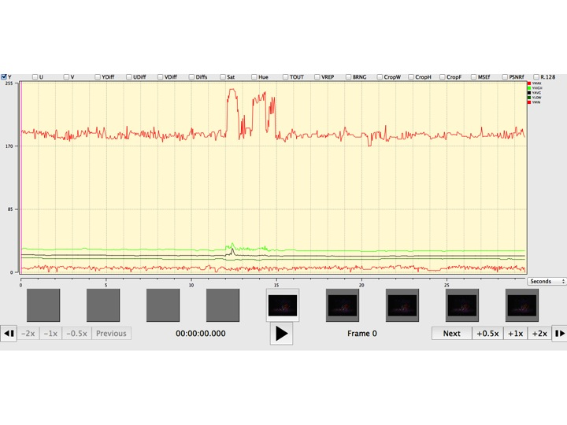

### U, V Value Filters: U MIN, U AVG, U MAX/ V MIN, V AVG, V MAX

| Filter Domain | Filter Name(s) | Values |
| U Channel | U MIN, U AVG, U MAX | 0-255 |
| V Channel | V MIN, V AVG, V MAX | 0-255 |

The U and V Channels represent the [chrominance](http://preservation.bavc.org/artifactatlas/index.php/Chrominance_Noise), or color differences of a picture. U and V filters act to detect color abnormalities in video. It can be difficult to derive meaning from U or V values on their own, but they provide supplementary information and can be good indicators of artifacts, especially when occurring in tandem with similar Y Value readings. Black and white video contains no chrominance information so should present flat-lines (or no data) for UV channels. Activity in UV Channels for black and white video content, however, would certainly be an indication of chrominance noise. Alternatively, a color video which shows flat-lines for these channels would be an indicator of a color drop-out scenario.

U values, V values = Combined graph of U MIN, U LOW, U AVG, U HIGH, and U MAX, Combined graph of V MIN, V LOW, V AVG, V HIGH, V MAX

U MIN, V MIN = U channel minimum, V channel minimum
U LOW, V LOW = U channel 10th percentile, V channel 10th percentile
U AVG, V AVG = U channel average, V channel average
U HIGH, V HIGH = U channel 90th percentile, V channel 90th percentile
U MAX, V MAX = U channel maximum, V channel maximum

#### Samples which demonstrate U/V Value anomalies:

The graph of this video file shows dramatic spikes and drops in U and V MIN/MAX values. You can also see attendant activity in the Sat (Saturation) and MSEf (Mean Square Error) filters (see descriptions below).

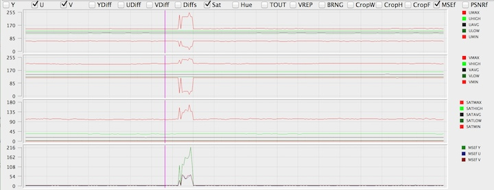

This is a good example of dramatic activity in U and V channels showing around the 4-6s mark, corresponding to chrominance noise in the video (visible rainbow-ed speckles across the picture).

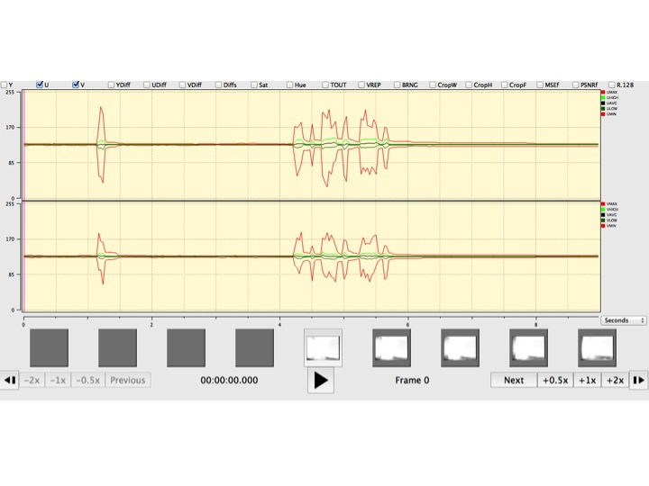

Notice U noise in the graph below from approximately 2.86s to 4.37s. Also seen in U DIF reading.

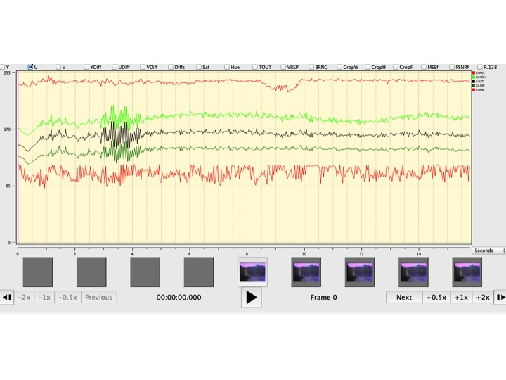

## YUV Values/ Difference {#diff}

| Filter Domain | Filter Name(s) |
| Y Channel | Y DIF |
| U Channel | U DIF |
| V Channel | V DIF |

This QCTools filter selects two successive frames of video and subtracts the values of one from the other in order to find the change, or difference, between the two frames (measured in pixels). This information is meaningful in that it indicates the rapidity with which a video picture is changing from one frame to the next. Aside from scene-change scenarios, a video picture should not undergo dramatic changes in these values unless an artifact is present. A scene-change would present as a short but dramatic spike in the graph, and that is normal. Other YUV Difference spikes may be present in cases where picture problems are visible. Often, head problems with corrupted frames will result in large YUV Difference values/graph spikes.

Y DIF = Difference of Y Channel between two frames
U DIF = Difference of U Channel between two frames
V DIF = Difference of V Channel between two frames

#### Samples which demonstrate YUV Difference anomalies:

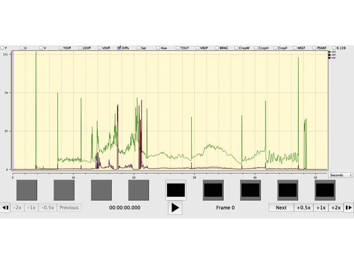

## Saturation {#saturation}

| Filter Domain | Filter Name(s) | Range |
| Saturation | Sat | 0-181.02 |

'Saturation' is a measure of the degree to which a color is diluted with white light; in other words--how vivid or 'true' a color is. Other terms, like 'bright', 'pale', 'pastel' 'washed out', etc. may be used to be speak to the quality of Saturation. A vectorscope view is a good way to see Saturation data--a large plot area indicates much saturation while a small plot area indicates little to none. A Saturation rate of 128 is considered illegal because data in this range can't be translated to/from camera data, and a videotape is technically incapable of storing values in this range (or beyond).

The saturation graph offers two plot lines to denote specific ranges of saturation levels. The purple dash-dot line near 89 represents the approximate limit of broadcast-safe saturation. Color bars at 75% should plot at this level. At 118 is a red dash-dot line to mark the limit of the YUV colorspace in bt601 to properly convert back to RBG. Saturation levels that exceed the red dash-dot line would result in either negative or overflow numbers when converted back to RGB and thus need to be clipped.

## Hue {#hue}

| Filter Domain | Filter Name(s) | Range |
| Hue | Hue | 0-360 |

'Hue' is a term used to describe color; "Blue" or "Red" can be thought of as Hues (see also 'Saturation'). In analyzing video, skin tone is often a good baseline against which to measure appropriate color representation. Skin tone should fall in the 147 range; if skin tone registers significantly above or below that number, it's likely an indication that your video isn't accurately storing or displaying color data accurately. For reference the hue filter measures green at 38 degrees, yellow at 99 degrees, red at 161 degrees, magenta at 218 degrees, blue at 279 degrees, and cyan at 341 degrees.

## Temporal Outliers (TOUT) {#tout}

| Filter Domain | Filter Name(s) | Range |
| Temporal Outliers | TOUT | 0-1 |

This filter was created to detect white speckle noise in analog VHS and 8mm video. It works by analyzing the current pixel against the two above and below and calculates an average value. In cases where the filter detects a pixel value which is dramatically outside of this established average, the graph will show small spikes, or blips, which correspond to white speckling in the video. The range of 0-0.009 could be considered normal and anything above that range may be a quality issue.

#### Samples which demonstrate Temporal Outliers' anomalies:

You can see several blips in the graph reading, especially around 7.5s, 15s, and 24s

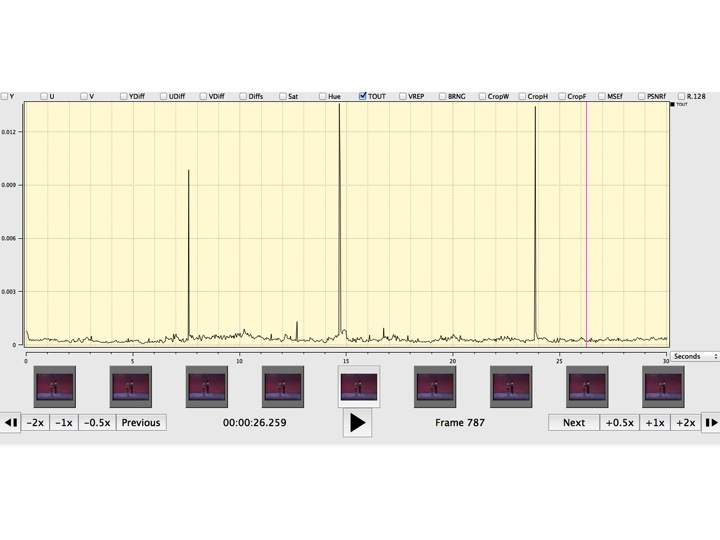

## Vertical Line Repetitions (VREP) {#vrep}

| Filter Domain | Filter Name(s) | Range |
| Vertical Line Repetitions | VREP | 0-1 |

Vertical Line Repetitions, or the VREP filter, is useful in analyzing U-Matic tapes and detecting artifacts generated in the course of the digitization process. Specifically, VREP detects the repetition of lines in a video. If a [time base corrector](http://en.wikipedia.org/wiki/Time_base_correction) notices a video signal dropout, it will compensate by playing the same line of data several times, hence the appearance of repetitious lines.The filter works by taking a given video line and comparing it against a video line that occurs 4 pixels earlier. If the difference in the two is less than 512, the filter reads them as being close enough to be appear repetitious. Cleaning your deck and/or tape may remediate this problem.

#### Samples which demonstrate Vertical Repetition anomalies:

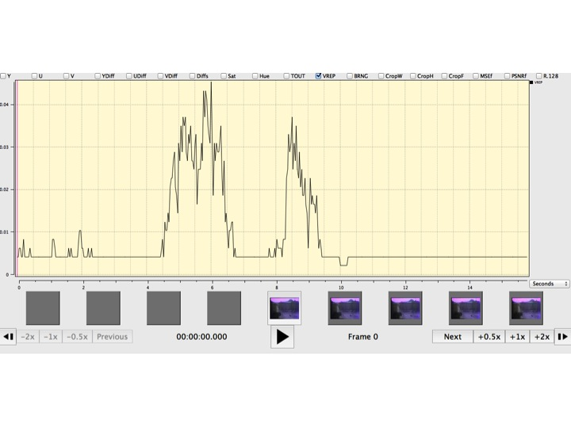
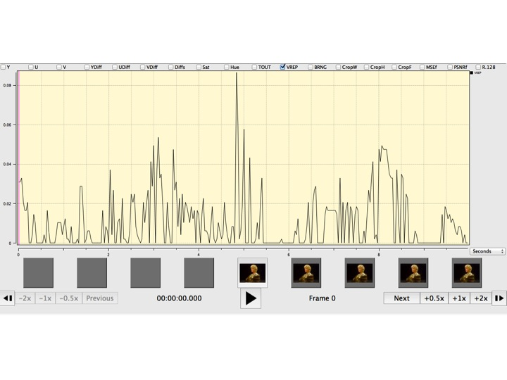

## Broadcast Range (BRNG) {#brng}

| Filter Domain | Filter Name(s) | Range |
| Broadcast Range | BRNG | 0-1 |

The BRNG filter is one that identifies the number of pixels which fall outside the standard video [broadcast range](http://en.wikipedia.org/wiki/Broadcast_range) of 16-235 pixels. Normal, noise-free video would not trigger this filer, but noise occurring outside of these parameters would read as spikes in the graph. Typically anything with a value over 0.01 will read as an artifact. While the RANG filter is good at detecting the general presence of noise, it can be a bit non-specific in its identification of the causes.

BRNG = Broadcast Range

#### Samples which demonstrate Broadcast Range anomalies:

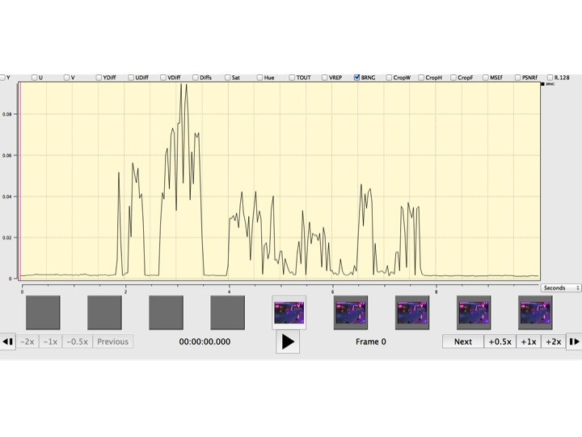 

## Crop Width (CropW) {#cropw}

This filter detects portions on either side of your video which may contain not contain any picture data. In the case of pillarboxing, for example, you'll have black bars on the left and right sides of your video. This filter will detect and present that information in the graph reading.

## Crop Height (CropH) {#croph}

This filter enables you to view which parts, if any, of your video which contain no picture data. In the case of letterboxing, for example, you'll have black bars both above and below your picture. This filter would detect and present that in the graph reading.

## Peak Signal to Noise Ratio (PSNRf) {#psnrf}

This filter plots the Peak Signal to Noise Ratio between the video in field 1 (odd lines) versus the video in field 2 (even lines). Lower values indicate that field 1 and field 2 are becoming more different as would happen during a playback error such as a head clog. See [http://ffmpeg.org/ffmpeg-filters.html#psnr](http://ffmpeg.org/ffmpeg-filters.html#psnr) for more information.

#### Samples which demonstrate Peak Signal to Noise Ratio anomalies:

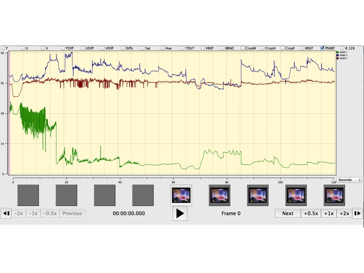

## Mean Square Error (MSEf) {#msef}

This filter is similar to PSNRf but reports on the Mean Square Error between field 1 and field 2\. Higher values may be indicative of differences between the images of field 1 and field 2.

#### Samples which demonstrate Mean Square Error anomalies:

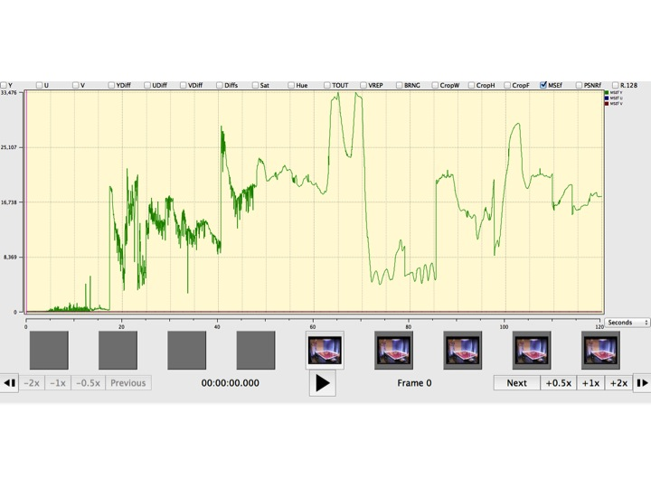

## Structural SImilarity Metric (SSIMf) {#ssimf}

This filter plots the Structural SImilarity Metric between the video in field 1 (odd lines) versus the video in field 2 (even lines). Lower values indicate that field 1 and field 2 are becoming more different as would happen during a playback error such as a head clog. See [http://ffmpeg.org/ffmpeg-filters.html#ssim](http://ffmpeg.org/ffmpeg-filters.html#psnr) for more information.

## Interlacement Detection (single frame) {#singleframe}

This filter plots a determined on if the frame appears to be bottom field first (bff), top first field (tff), progressive (prog), or undetermined (und). This assessment uses only adjacent frames to determine the interlacement characteristic. The value is plotted with a half-life of 1, so each frame's interlacement characteric is halved (i.e., it contributes only 0.5 to it's classification) and then plotted. See [http://ffmpeg.org/ffmpeg-filters.html#idet](http://ffmpeg.org/ffmpeg-filters.html#psnr) for more information.

## Interlacement Detection (multiple frames) {#multiframe}

Similar to single-frame interlaced detection, but incorporates the classification history of previous frames. See [http://ffmpeg.org/ffmpeg-filters.html#idet](http://ffmpeg.org/ffmpeg-filters.html#idet) for more information.

## Interlacement Detection (repeated fields) {#repeated}

This plots uses an assessment that tries and detects fields that are repeated between adjacent frames (a sign of telecine). See [http://ffmpeg.org/ffmpeg-filters.html#idet](http://ffmpeg.org/ffmpeg-filters.html#idet) for more information.

## Audio

## R.128 {#r128}

R 128 refers to a European Broadcasting Union (EBU) [specification document](https://tech.ebu.ch/docs/r/r128.pdf) governing several loudness parameters, including momentary, integrated, and short-term loudness. QCTools specifically examines momentary loudness, or sudden changes in volume over brief intervals of time (up to 400ms). This can be helpful in identifying areas where volume may exceed upper loudness tolerance levels as perceived by an audience.

## Audio Phase Meter {#phase}

Provides a metric to represent the mean phase of each audio frames. Value is in range [-1, 1]. The -1 means left and right channels are completely out of phase and 1 means channels are in phase. See [https://ffmpeg.org/ffmpeg-filters.html#aphasemeter](https://ffmpeg.org/ffmpeg-filters.html#aphasemeter) for more information.

## DC Offset {#dc}

For selected audio tracks this graph plots the DC offset (mean amplitude displacement from zero), minimal sample level, and maximum sample level. Note that this value is plotted per audio frame and not per audio sample.

## Audio Diffs {#audio-diffs}

For selected audio tracks this graph plots the minimal difference between two consecutive samples, maximal difference between two consecutive samples. and the mean difference between two consecutive samples (the average of each difference between two consecutive samples) A sharp spike in the maximum difference between consecutive samples may be indicative of an interstitial error. Note that this value is plotted per audio frame and not per audio sample.

## RMS {#rms}

For selected audio tracks this graph plots the Standard peak and RMS level measured in dBFS and the Peak and trough values for RMS level measured over a short window. Note that this value is plotted per audio frame and not per audio sample.
