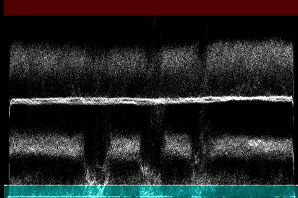
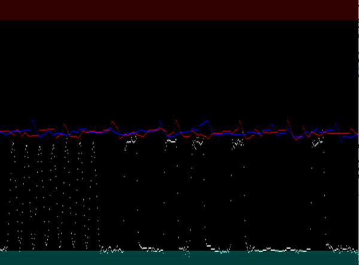
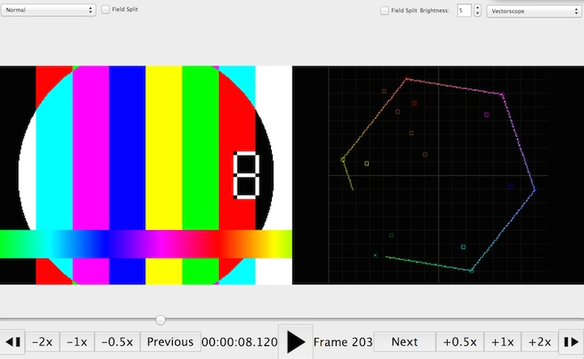
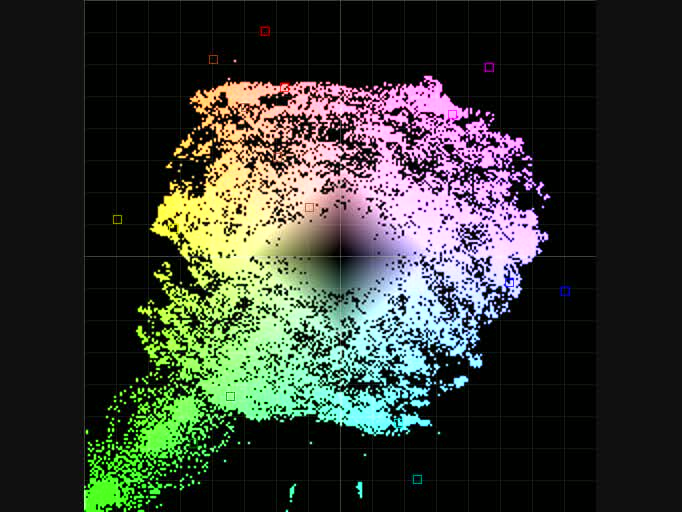
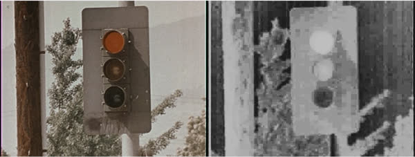
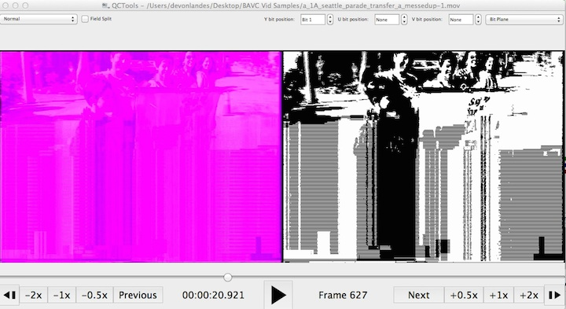
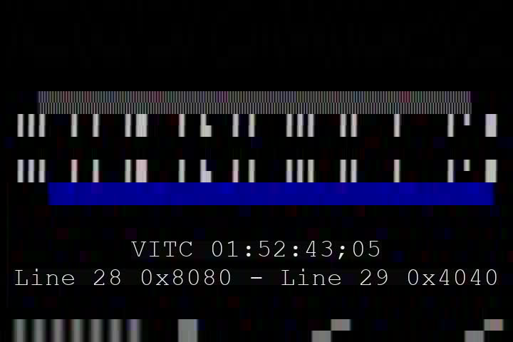
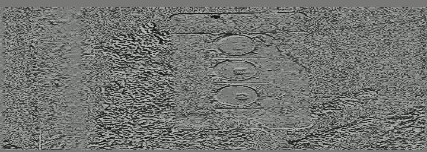

# Playback Filter Descriptions

The QCTools preview window is intended as an analytical playback environment that allows the user to review video through multiple filters simultaneously. Often inconsistencies within the graph layout may be better understood by examining those frames in the playback window. The playback window includes two viewing windows which may be set to different combinations of filters. This allows a user to playback a video by multiple forms of analysis simultaneously just as viewing a waveform and a vectorscope side-by-side or seeing the video with highlighted pixels that are outside of broadcast range while seeing the waveform display.

## Help

This selection will launch the Playback Filters window where you may review the documentation.

## No Display

This option enables you to remove one display, thereby only showing one view. This option allows a single playback window to occupy a greater amount of screen-space.

## Normal

This view simply shows the video as QCTools interprets it, no special effects or filtering are added. In this view, however, you also have the option of enabling a **'Field'** display which splits the two video fields for the selected frame and displays them as discrete images. Thus all odd-numbered video lines appear are resorted to appear on the top of the image and the even-numbered lines appear on the bottom. Since many analog video issues occur differently between the two interlaced fields, splitting the fields into two distinct images can make it easier to see if a given issue is from problems with the analog video playback device (such as a head clog where the two fields would react very differently) and tape damage (where the two fields would react similarly).

This image shows two Normal displays side-by-side where the right image has **'Field'** enabled. By viewed the fields separated on the right, it is easily clear that while field 1 was read correctly from the tape, there was no color data was read for field 2\. This issue was due to a head clog and fixed by cleaning the video player and re-digitizing the content.

## Histogram

The histogram shows the frequency of occurrence of values per channel. Typically the histogram will show one graph per channel (one for each Y, U, and V or one for each red, green, and blue). Video with a lot of contrast and a well distributed range of luminance values will result in a histogram with an even spread. You may also select **'Field'** option which will depict fields 1 and 2 separately (field 1 on top, field 2 on bottom).

## Waveform

The waveform plots the brightness of the image, each column of the waveform corresponds to a column of pixels in the source video. The pixels of each column are then plotted in an 8-bit scale (0-255) which is equivalent to 0 to 110 IRE. The range from 0-16 (0 to 7.5 IRE) is highlighted in blue and indicates a black value that is below traditional NTSC broadcast range. The range from 235-255 (100 to 110 IRE) is highlighted in red and indicates a white value that is above broadcast range. For most analog media the intended pixel luminosity values should exist between 7.5 and 100 IRE. You may also select **'Field'** option which will depict fields 1 and 2 separately (field 1 on top, field 2 on bottom).

Traditionally a waveform plots the values of each column of video pixels. The QCTools waveform also provides a **'Vertical'** option which plots the video as rows of pixels. The waveform will still show the value range of the whole frame whether **'Vertical'** is enabled or not, but with **'Vertical'** enabled it is often easier to detect video issues that affect rows of pixel data such as dropouts. The waveform player is based on the [waveform filter](https://ffmpeg.org/ffmpeg-filters.html#waveform) from FFmpeg.

The waveform player provides the following options:

*   Field: If the checkbox is enabled the player will show two waveforms side-by-side that depicts field 1 and field 2 separately.
*   Intensity: Set intensity. Smaller values are useful to find out how many values of the same luminance are distributed across input rows/columns. Default value is 0.1\. Allowed range is [0, 1].
*   Y/U/V/A: Select which plane is presented in waveform view ("A" means that all planes are shown).
*   Vertical: If checked then the waveform will plot on rows rather than columns. It is the equivalent of rotating the video image by 90 degrees and applying a waveform to the result.
*   Filter: The waveform filter can be adjusted to different displays. The default is 'lowpass'. See [FFmpeg's waveform documentation](https://ffmpeg.org/ffmpeg-filters.html#waveform) for information on each option.
*   Peak: If enabled, the waveform will outline the extent of the plotted values to show an envelope around the plotted values. Peak may be adjusted to outline the extent frame-per-frame or over time.

## Waveform Target

The Waveform Target is similar to the Waveform filter but a box is drawn over the image by setting an x and y coordinate and size of the box. The waveform image drawn will depict the waveform plotting of only the samples within the box. The original image may be shown as a background to the vectorscope by enabling the 'Background' checkbox.

## Line Select

Allows a user to select one line of video signal to display as a waveform. Includes **'Vertical'** and **'Background'** modes. When **'Vertical'** is enable the user may select to plot a waveform of a single column rather than the default plot of a single row. The **'Background'** option shows the frame image under the waveform with the highlighted row or column highlighted in yellow.

## Vectorscope

A vectorscope display. This display plots chroma values (U/V color placement) in two dimensional graph (which is called a vectorscope). It can be used to read of the hue and saturation of the current frame. The whiter a pixel in the vectorscope, the more pixels of the input frame correspond to that pixel (that is the more pixels have this chroma value). The V component is displayed on the vertical (Y) axis, with the bottom edge being V = 0 and the top being V = 255\. The U component is displayed on the horizontal (Y) axis, with the left representing U = 0 and the right representing U = 255.
Six blocks are highlighted to depict standardized color points for red (90, 16), green (54, 222), blue (240, 146), cyan (166, 240), magenta (202, 44), and yellow (16, 110). All valid chroma values fall within a circlular shape from the center to the outer edge of the plot.You may also select **'Field'** option which will depict fields 1 and 2 separately (field 1 on top, field 2 on bottom).

The vectorscope player provides the following options:

*   Field: If the checkbox is enabled the player will show two waveforms side-by-side that depict field 1 and field 2 separately.
*   Intensity: Set intensity. Smaller values are useful to find out how many values of the same luminance are distributed across input rows/columns. Default value is 0.1\. Allowed range is [0, 1].
*   Mode: The vectorscope filter can be adjusted to different displays. The default is 'color3'. See [FFmpeg's vectorscope documentation](https://ffmpeg.org/ffmpeg-filters.html#vectorscope) for information on each option.
*   Peak: If enabled, the vectorscope will outline the extent of the plotted values to show an envelope around the plotted values. Peak may be adjusted to outline the extent frame-per-frame or over time.

## Vectorscope Target

The Vectorscope Target is similar to the Vectorscope filter but a box is drawn over the image by setting an x and y coordinate and size of the box. The vectorscope image drawn will depict the vectorscope plotting of only the samples within the box. The original image may be shown as a background to the vectorscope by enabling the 'Background' checkbox.

## Waveform / Vectorscope

This filter plots the Waveform and Vectorscope on top of each other so that both are shown in one display. The brightness of both the waveform and vectorscope may be adjusted for clarity.

## Extract Planes Equalized

This filter extracts a specified video plane (such as Y, U, or V) which represents the luma or part of the chroma data from the video so that it may be reviewed on its own. The filter also may apply histogram equalization to redistributes the pixel intensities to equalize their distribution across the intensity range (this feature can help exaggerate or clarify the details of the plane image). This filter is useful for detecting lossy compression in video signals or establishing provenance.

This image shows the Normal display on the left and Extract Planes on the right. The Extract Planes filters reveals the macroblock pattern of lossy MPEG2 compression in the square patterns throughout the image.

## Extract Planes UV Equalized

This filter is similar to the **Extract Planes Equalized** filter but shows the two chroma planes (U and V) side by side.

## Bit Plane

This filter selects the bit position of each plane for display. Selecting 'None' for a plane will replace all values with 0x80 (middle gray for Y and no color for U or V). Selecting 'All' will send the display plane as is. Selecting 'Bit [1-8]' will display only that specific bit position of each pixel of the plane. For the Y plane a pixel will display as black if that bit is '0' or white if that bit is '1'. For U a pixel will be yellow-green if '0' purple if '1'. For V a pixel will be green for '0' and red for '1'.
Generally lossy video codecs will show blocky structured patterns at higher numbered bit positions. See the [bit plane article](https://en.wikipedia.org/wiki/Bit_plane) in Wikipedia for more information about the application of bit plane filtering.

(Video sample and permission to use provided by [seattle.gov](https://www.seattle.gov))

## Bit Plane 10 slices

This filter is similar to Bit Plane, but it shows a section of each of the first 10 bit planes at once in the selected plane. The slices are presented in most-significant to least-significant order as left to right (or top to bottom if 'Rows' is selected). Each of the 10 bit planes is marked by a green border.

## Bit Plane Noise

This filter is similar to Bit Plane, but instead of showing if the selected bit position of a selected plane is set to 0 or 1, it attempts to predict if that bit represents signal or noise. This filters uses a [method](https://en.wikipedia.org/wiki/Bit_plane) for calculating this by comparing each pixel's selected bit (X,Y) to selected bit of three adjacent pixels (X-1,Y), (X,Y-1) and (X-1,Y-1). If the bit is the same as at least two of the three adjacent bits, it may not be noise. A noisy bit-plane will have 49% to 51% pixels that are noise.

## EIA608 VITC Viewer

This filter interprets potential VITC and EIA608 (often referred to as line 21) data to display the values stored as timecode and/or captions. By default the top 30 lines of video are assessed for this data but the scan_max option can adjust the number of top lines to assess from 1 to 100. EIA608 data will be shown in hexadecimal form along with the number of the line (counting from 1 as the top line). There is a 'zoom' option which will crop and scale the selected lines so that they can be viewed in more detail. If VITC or EIA608 data is not found then hyphens will be shown instead.

Several options from FFmpeg's readeia608 filter are accessible:

- scan_max: set to which line to scan for codes (default 30)
- msd: set first two max start code bits differences (from 0 to 0.5) (default 0.02)
- chp: check and apply parity bit (default false)

For more information, see the documentation on FFmpeg's [readvitc](https://ffmpeg.org/ffmpeg-filters.html#readvitc) and [readeia608](https://ffmpeg.org/ffmpeg-filters.html#readeia608) filters. A sample IMX file with both VITC and EIA608 data is available at the [Internet Archive](https://archive.org/download/vitc_eia608_sample/vitc_eia608_sample.mov).

## Value Highlight

This filter selects a video plane and highlights values with a specified range of minimum value to maximum value. The original image of the plane will be presented in grayscale and values within the range will be highlighted as yellow; for instance to highlight Y values below NTSC broadcast range, set plane to Y, min to 0 and max to 16\. The resulting image will highlight Y values below broadcast range in yellow.

## Saturation Highlight

Highlights saturation with a user-defined range of minimum value to maximum value. Includes field mode.

## Chroma Adjust

This filter enables the hue and saturation levels to be adjusted. Hue adjustments may be expressed in degrees where 0 is no change and 180 would invert the color. For saturation a value of 1 needs the saturation unchanged, 0 removes all color, and the saturation may be increased up to a maximum of 10\. The chroma values (Cb and Cr) may also be shifted by increasing or decreasing their values (similar to Red Shift/Blue Shift on a time-base corrector).

## Color Matrix

Allows for playback in various color spaces, including BT.601, BT.709, SMPTE240M and FCC. The filter includes a **Reveal** slider so that the original image and a version interpreted through the selected color matrix may be shown side-by-side for review.

## Sample Range

This filter operates similarly to **Color Matrix** but shows the original image alongside a version interpreted through a selected sample range. Here you can see how the video would look it interpretted as either full range or broadcast range.

## Field Difference

This presentation visualizes the difference between video field 1 and field 2\. A middle gray image would mean that field 1 and field 2 were identical, whereas deviation to white or black indicates a difference.

## Temporal Difference

Displays an image obtained from the temporal difference between successive frames. Note that because this filter requires more than one frame to display the filter will need to be in playback mode to reveal an image.

## Pixel Offset Subtraction

Displays an image by subtracting the offset level from each successive pixel.

## Broadcast Range Pixels

This is the same presentation as 'Normal' except that pixels that are outside of broadcast range are highlighted as white. Again here, you have the option of selecting **'Field'** to display field 1 (top) and field 2 (bottom) separately.

## Broadcast Illegal Focus

For video that uses the YUV colorspace and decode in a broadcast range. Values from 0-16 (on an 8 bit scale) will all decode to black on a computer monitor, while values from 235-255 will decode as white. This filter allows the users to select to feature pixel data that is outside of broadcast range. Select "above whites" to set pixels with luma values from 236-255 to a range of grays (while all other pixels are set to black). Select "below black" to set pixels with luma values from 0-15 to a range of grays (while all other pixels are set to black). If a video frame only contains pixels that have luma values within broadcast range, then this filter will play black only black pixels. This filter portrays broadcast range compliance in somewhat the opposite way as the "Broadcast Range Pixels" filter since it focuses on values that may be crushed to black or white because they fall outside of broadcast range. Note that some videos may intentionally be encoded in 'full range' where this filter is less relevant.

## Temporal Outlier Pixels

This is the same presentation as 'Normal' except that pixels that are labelled as temporal outliers are highlighted as white. Temporal outliers are pixels that significantly differ from their neighbors and often correspond to tape damage or playback error. Select **'Field'** to see the fields displayed separately.

## Vertical Line Repetitions

This filter displays repetitive lines of video data.

## Frame Tiles

Displays a user-defined "tiled" mosaic of successive frames. Maximum 12x12 grid. Note that because this filter requires more than one frame to display the filter will need to be in playback mode to reveal an image.

## Zoom

Allows a user to zoom to a particular portion of the image using X and Y coordinates. Includes "Strength" and "Intensity" modes.

## Audio Spectrum

Displays an visualization of the audio spectrum. Note that because this filter requires more than one frame to display the filter will need to be in playback mode to reveal an image.

## Audio Waveform

Displays an visualization of the audio waveform. Note that because this filter requires more than one frame to display the filter will need to be in playback mode to reveal an image.

## Show CQT

Displays an visualization of the audio on a musical scale.

## Audio Vectorscope

Plots two channels of audio against each other on different axis. This display can show if audio is out-of-phase (displays as a horizontal line), dual-mono (displays as a verical line), or stereo (displays as a two dimensional complex shape).

## Audio Phase Meter

Shows the output of FFmpeg's [aphasemeter](https://ffmpeg.org/ffmpeg-filters.html#aphasemeter) filter.

## Audio Frequency

Shows the output of FFmpeg's [showfreqs](https://ffmpeg.org/ffmpeg-filters.html#showfreqs) filter.

## Audio Volume

Shows the output of FFmpeg's [showvolume](https://ffmpeg.org/ffmpeg-filters.html#showvolume) filter.

## Audio Bit Scope

Shows an audio bit scope visualization of the audio. See FFmpeg's [abitscope](https://ffmpeg.org/ffmpeg-filters.html#abitscope) filter.
